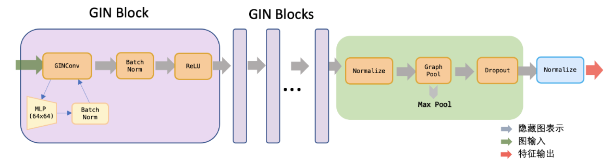

# Graph Backdoor Attack

# Main Reference:

- [1] [Backdoor Attack](https://github.dev/zaixizhang/graphbackdoor).  
- [2] [GCC: Unsupervised Contrastive Learning](https://github.com/THUDM/GCC).  

# Whether backdoor attack can be applied on GCC model?

Branch: ssl backdoor attack.   

CLGBD: Contrastive Learning Graph Backdoor Attack ~~

Pipeline: Pretrain -> Generate -> Downstream Tasks 

#### Surrogate Model \<GCC Encoder\>

[GIN](https://arxiv.org/pdf/1810.00826.pdf)

     

#### A pipeline of Unsupervised Graph Backdoor Attack (on Graph Contrastive Learning Model)

#### Loss Function

<!--#### Result

The Impact of Backdoor Injected Rate (in test phase) on CAD [Clean Accuracy - Backdoor Accuracy] and ASR

Not so powerful. -->

Future: Unsupervised Graph backdoor attack could be enhanced with other backdoor attack strategies, such as [Bi-Level Optimization](https://arxiv.org/pdf/2006.11890.pdf) or [UGBD](https://arxiv.org/pdf/2303.01263.pdf)   

Next: => How to defend against it?
